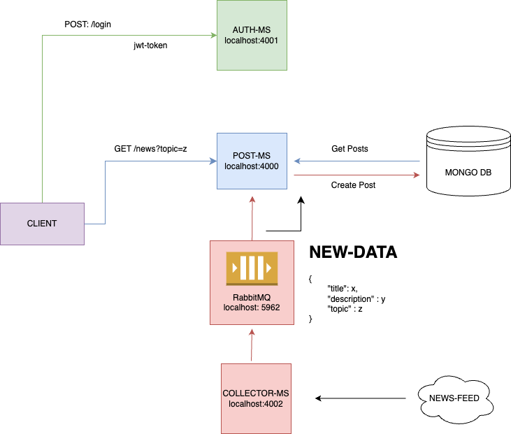

# News collector Application Documentation



This application divided into microservices provides real-time news updates from various rss feeds based on topic (ex. technology, markets)

## Microservices

- **Auth Microservice:**
  It manages authentication so that the user's private area can be accessed. It returns a jwt-token
  An example user has been created:
  email: jhon.doe@gmail.com
  password: test

- **Collector Microservice:**
  This microservice schedules a call to various rss feeds and via RabbitMQ acting as PRODUCER, communicates news to the Post Microservice

- **Post Microservice :**
  This microservice handles the messages sent by the collector microservice actings as CONSUMER and saves new posts to a mongodb database with a specified topic category.
  Returns all posts to the user after a jwt-token verification

## Technologies Used

- **Frontend:** React.js with Typescript
- **Backend:** Node.js, Express.js
- **Database:** MongoDB with Mongoose ODM
- **Queue Message:** Rabbit MQ

## Prerequisites

- Node.js installed
- MongoDB server running
- RabbitMQ server running

## Start Rabbit mq

```
docker run -it --rm --name rabbitmq -p 5672:5672 -p 15672:15672 rabbitmq:3.13-management
```

## Start Auth microservices

cd ./auth
npm i
npm run start

## Start Posts microservices

cd ./post
npm i
npm run start

## Start Collector microservices

cd ./collector
npm i
npm run start

## Start frontend

cd ./client
npm i
npm run start
